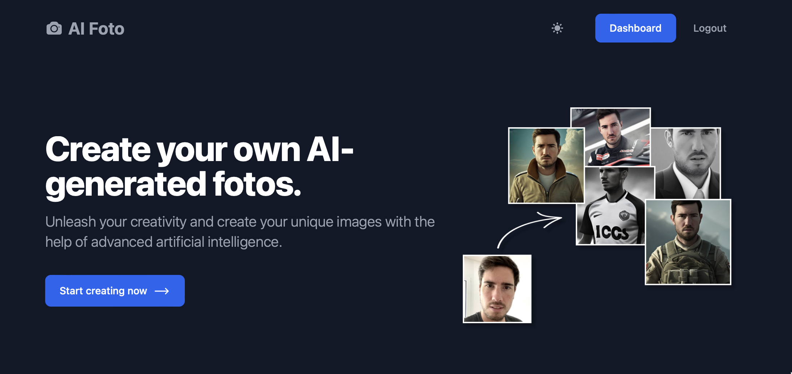

[](https://app.netlify.com/sites/aifoto/deploys) <a href="https://opensource.org/licenses/MIT">

# AI Foto

## Create your own AI-generated fotos

Unleash your creativity and create your unique images with the help of advanced artificial intelligence.

## Demo

Check the web app 👉
[https://aifoto.netlify.app](https://aifoto.netlify.app)

Use coupon code **SUPAHACK30** for 30% Supabase hackathon discount.

## Tech stack

- Supabase Authentication
- Supabase Database
- Supabase Storage
- SvelteKit
- Tailwind
- Flowbite (Flowbite-Svelte)
- Replicate API for AI generation
- Hosted on Netlify

## Running locally

Just the usual simple steps:

```bash
npm install
npm run dev
```

## Building

To create a production version of your app:

```bash
npm run build
```

You can preview the production build with `npm run preview`.

> To deploy your app, you may need to install an [adapter](https://kit.svelte.dev/docs/adapters) for your target environment.
